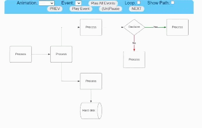
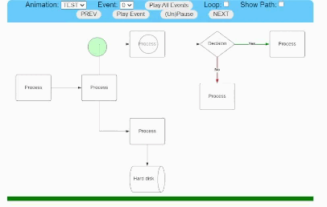
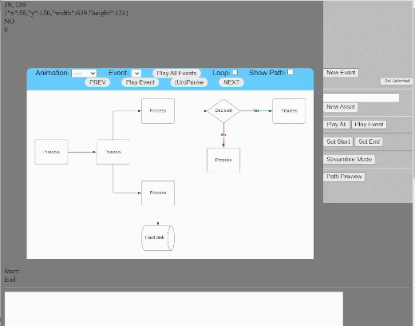
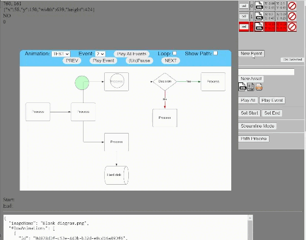
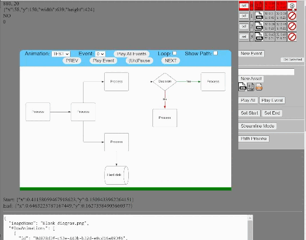
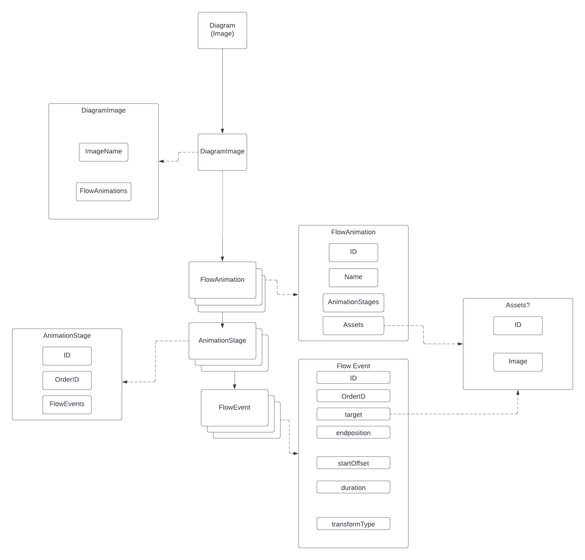

# Diagram Web Animator

## Description

JavaScript framework to add a layer of animation onto an in browser diagram (image)

## Usage

Best option when getting errors is to do a refresh on the page.

### Path Preview
Turning this mode on will show a line on the diagram where the animation path will follow based on existing events.

You can use either [UploadDemo.html](UploadDemo.html) to upload an image and start working with it or change the src tag in [index.dev.html](index.dev.html) and work with the debug tools.

### Assets
There are 3 default assets included on animation creation. More can be added in the editor but right now it's clumsy between storing local files (in the [build/static/images](build/static/images) folder) and using files that are available online. Mainly: if you want to use a file local on your machine best to upload it to the image directory and reference by adding it as (static/images/<your image name>).

If you want to load custom data you can pass it into SetupDiagramAnimator when loading the diagram.

### Editor Controls
1. Editor control Table (see below)
2. Add new event to animation
3. Delete selected event from animation
4. Add new Asset to animation set
5. Set Start position of selected event
6. Set End position of selected event
7. Enable/Disable Streamline Mode (see below)

Adding events works in most cases but there are edge cases where if the data is empty then starting up new data can throw errors.

### Editor Control Table
The editor control table in the top right allows you to do the following with existing rows:
1. Clicking the image in the 3rd column will cycle the image used in rendering. Sourced from asset list below table.
3. Clicking the image in the last column will cycle the image transform used during the event

**Example Transformations**

### Streamline Mode
This is a mode allowing you to click a series of positions on an image and the code will take care of setting up proper start/end positions based on each click. Not 100% perfect and mainly to use on empty animations. Requires clicking the button to 'finish' or turn off the mode.

### Generating/Exporting Data
The debug pages mentioned above have a section at the bottom that automatically updates with any currently active animation being used. This data can be copied into a string variable and parsed by the diagram constructor. (** note that the export data has a blob for the image name and will need to be replaced to match your desired image)

## Static Setup

The static HTML files require no setup and can be run in browser from the file system.

Static Files:
1. [index.html](index.html): Auto-load. No editor controls. Simulated surrounding content.
2. [index.dev.html](index.dev.html): Auto-load. Editor/Debug controls.
3. [legacymigration.html](legacyMigration.html): Auto-Load. Working example using code flow
4. [UploadDemo.html](UploadDemo.html): Allow user to upload an image file. Editor/Debug controls.

## Hosted Setup

1. Run npm install
    `npm install`
2. Run build
    `npm build`
3. Start server
    `npm run start`
    or
    `npm run start-dev`
4. Access default server page
    - [localhost:3000/static/index.server.html](http://localhost:3000/static/index.server.html)

### Hosted Dev Notes

The hosting system was created to support JavaScript modules. In order to allow modules the browser cannot access script files from the local file system (CORS errors).

The build script [modules.build.js](modules.build.js) is used to generate the hosted module files by searching for matching filenames that have ".excludes." and ".includes.". This results in not having to hand edit two sets of files on changes.

Exports and Includes are done manually (for now) although I'm sure there is a better system for doing this automatically.

## Class Diagram

